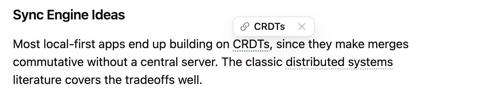

# Inline Link Suggestions

An [Obsidian](https://obsidian.md) plugin that spots plain-text mentions of your existing notes **while you write** and underlines them with a subtle dotted line. Click a mention to turn it into a `[[wiki link]]` — no sidebar, no dialogs, no leaving the flow of writing.

<picture>
  <source media="(prefers-color-scheme: dark)" srcset=".github/media/hover-dark.png">
  
</picture>

## Why

Obsidian's built-in *unlinked mentions* live in the backlinks sidebar: per-note, exact-title-only, and you have to go looking for them. This plugin brings unlinked mentions into the editor itself:

- **Titles and aliases** of all your notes are matched as you type.
- Mentions get a quiet dotted underline — no visual noise, theme-friendly.
- **Hover** an underline to see the suggested note above the text; click it to link: `[[Note Title]]` when the text matches the title, `[[Note Title|original text]]` when it matched an alias. Link style follows your "Use \[\[Wikilinks\]\]" preference. On mobile, tap the underline instead.
- Works in **reading view** too (opt-in setting) — linking edits the underlying note.
- A **Toggle suggestions** command lets you bind a hotkey to switch the whole feature on and off.
- **Ignore** any term from the ✕ button in the same popup if a suggestion is noise.
- Clicking the underlined text itself just places the cursor — editing is never hijacked.

## Features

- Fast: an Aho-Corasick automaton scans only the visible part of the editor, so it stays instant even in vaults with 10,000+ notes. Measured (`node scripts/profile.ts`): index build ~27 ms for 10k notes (~140 ms for 50k), and ~0.25 ms per viewport scan.
- Smart about context: text inside existing links, tags, code, frontmatter, math, and HTML is never underlined, and neither is the word your cursor is on.
- No self-links: a note never suggests linking to itself.
- Configurable: case sensitivity, minimum term length, alias matching, excluded folders, and a persisted ignore list.
- Local and private: no network requests, no telemetry, no runtime dependencies.
- Works on mobile.

## Settings

| Setting | Default | Description |
| --- | --- | --- |
| Enable suggestions | on | Master toggle (also a command for hotkeys). |
| Underline in reading view | off | Suggest and link in reading view too. |
| Case-sensitive matching | off | Require exact case to match. |
| Include aliases | on | Match frontmatter `aliases` too. |
| Minimum term length | 3 | Skip very short titles/aliases. |
| Excluded folders | — | Notes here are never suggested (e.g. `Templates/`). |
| Disabled folders | — | No underlines while editing notes here (e.g. `Journal/`). |
| Ignored terms | — | Never underline these; add from the mention popup. |

Folder and term lists are edited as removable chips — type in the field and press Enter to add.

## Installation

Not yet in the community plugin directory. Manual install:

1. Download `main.js`, `manifest.json`, and `styles.css` from the latest release.
2. Copy them into `<vault>/.obsidian/plugins/inline-link-suggestions/`.
3. Reload Obsidian and enable the plugin in **Settings → Community plugins**.

## Development

```bash
npm install
npm run dev              # watch build
npm test                 # unit tests for the matcher core
npm run test:e2e         # end-to-end tests in a real Obsidian instance
npm run test:e2e:mobile  # same suite, under Obsidian's mobile emulation
npm run build             # type-check + production build
```

The matching core (`src/core/`) is pure TypeScript with no Obsidian imports and is fully unit-tested. Editor integration lives in `src/editor/` (CodeMirror 6 view plugin).

### Mobile testing

End-to-end tests ([e2e/specs](e2e/specs)) run via [wdio-obsidian-service](https://github.com/jesse-r-s-hines/wdio-obsidian-service) against a real, freshly-downloaded Obsidian instance — no mocking. The same specs run twice: once as normal desktop Obsidian ([e2e/wdio.conf.mts](e2e/wdio.conf.mts)), once with `app.emulateMobile()` on ([e2e/wdio.mobile-emulation.conf.mts](e2e/wdio.mobile-emulation.conf.mts)), so the mobile-only tap-to-link path (the `Platform.isMobile` branch in [src/editor/highlighter.ts](src/editor/highlighter.ts)) is covered without needing a phone or emulator. Both run in CI on every push.

This doesn't cover the real mobile app's Capacitor runtime — only public CM6/Obsidian APIs are used here, so the risk is low, but if that ever matters, wdio-obsidian-service also supports testing the real Obsidian Android app via Appium; see its README.

## Roadmap

- **Phase 2 — semantic suggestions (opt-in):** underline phrases that are semantically close to an existing note even without a literal title match, using local embeddings (Ollama or any OpenAI-compatible endpoint). Local-first, cached on disk, off by default. The `SuggestionProvider` interface in `src/core/types.ts` is the seam where this plugs in.

## License

MIT
